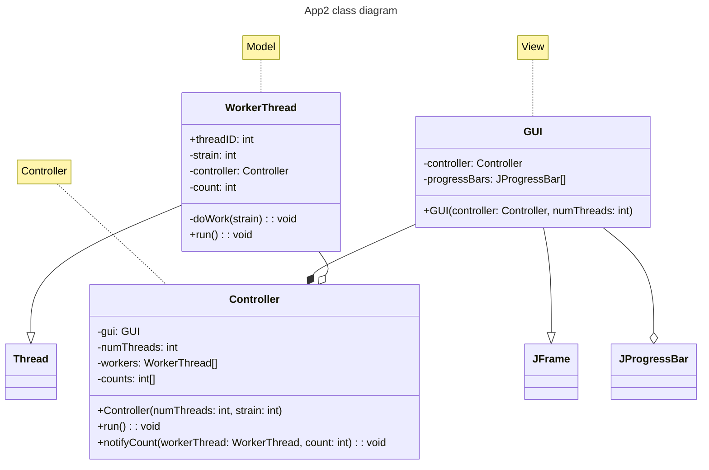
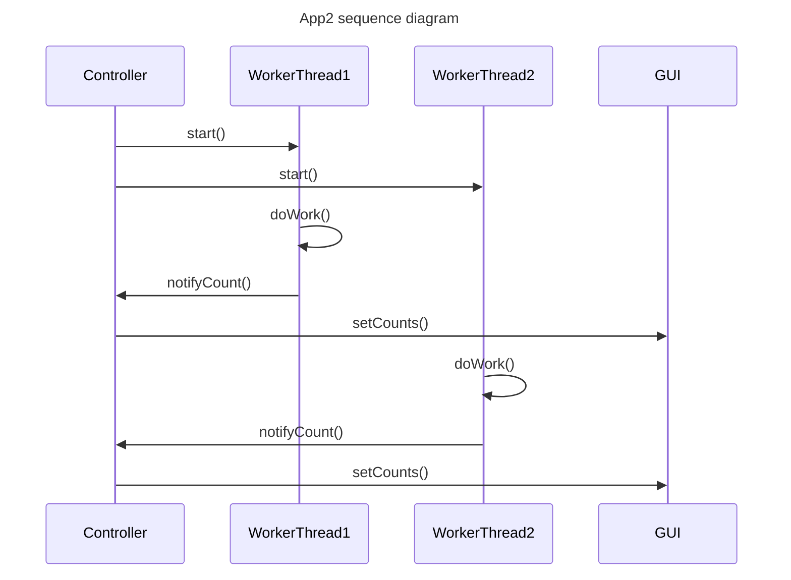

Tasks:
- lab 1 exercises 1, 2
- lab 2 App2 + CD + SQ
- extra credits: lab2 App3, App4

## Lab 1

exercise 1: add, multiply complex numbers
exercise 2: add, multiply 3x3 matrices

## Lab 2

### app 1 (given as-is): count the number of logical procesors

spawns many threads with various priorities. each thread increments an internal counter. the number of counters that grow "fast" corresponds to the number of CPU threads.

### app 2: app 1 + MVC + Observer-Observable

### app 3: 